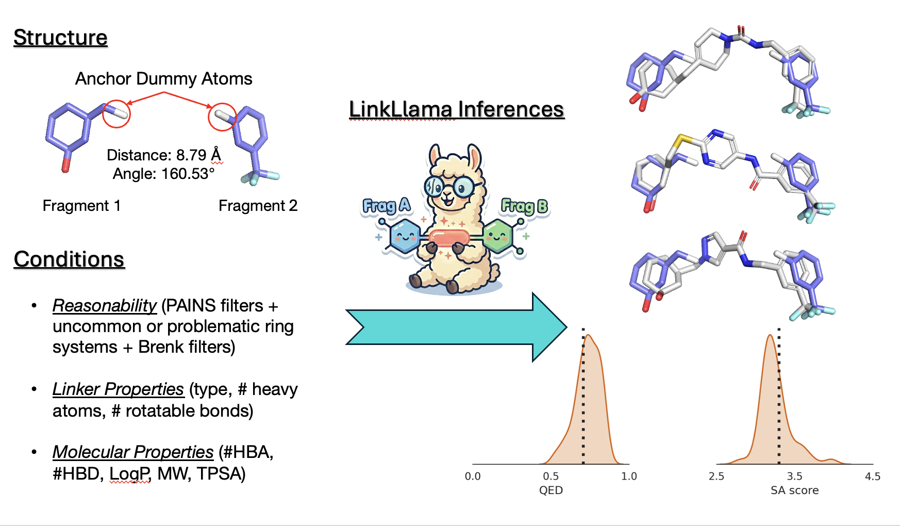

# LinkLlama: chemically reasonable linker design with large language models

[](LICENSE)
[](https://doi.org/10.6084/m9.figshare.32049072)
[](https://www.biorxiv.org/content/10.64898/2026.04.15.718690v1)
[](https://huggingface.co/THGLab/Llama-3.2-1B-Instruct-LinkLlama-Cap50)

---

## Overview



LinkLlama fine-tunes a Llama-class model to propose **linkers** between fragments using prompts with geometry and property constraints.

Training data are built from **ChEMBL**. For the data pipeline and LoRA setup, see the **[Retraining guide](assets/docs/retraining_guide.md)**.

---

## Usage

### Prerequisites

[Conda](https://docs.conda.io/) is recommended.

### Installation

```bash
git clone https://github.com/THGLab/LinkLlama.git
cd linkllama
conda env create -f environment.yml
conda activate linkllama
pip install -e .
```

Optional geometry benchmarks: `pip install -e ".[benchmark]"` (installs `spyrmsd`).

### Inference

- **Checkpoint:** [`THGLab/Llama-3.2-1B-Instruct-LinkLlama-Cap50`](https://huggingface.co/THGLab/Llama-3.2-1B-Instruct-LinkLlama-Cap50) on the Hugging Face Hub.
- **Default config:** [`data/inference_config.yaml`](data/inference_config.yaml) — `sampling.model_path` is set to that Hub id (same string as `AutoModelForCausalLM.from_pretrained(...)`).
- **Auth:** use `huggingface-cli login` or `HF_TOKEN` if the Hub requires it.
- **Docs:** **[Inference guide](assets/docs/inference_guide.md)**.
- **Tiny example:** [`data/zinc_minimal.csv`](data/zinc_minimal.csv) plus the same YAML; see [`data/README.md`](data/README.md).

### Retraining

Build JSONL with the `linkllama/llm` pipeline, then run Axolotl LoRA from YAML under `linkllama/training/`.

**[Retraining guide](assets/docs/retraining_guide.md)** — full steps and options.

### Pretrained weights (Hub)

| Resource | Link |
| --- | --- |
| Model weights | [`THGLab/Llama-3.2-1B-Instruct-LinkLlama-Cap50`](https://huggingface.co/THGLab/Llama-3.2-1B-Instruct-LinkLlama-Cap50) |
| Training JSONL | [`THGLab/LinkLlama-cap50-train`](https://huggingface.co/datasets/THGLab/LinkLlama-cap50-train) |

### Benchmark data and processed ChEMBL (Figshare)

Benchmark splits and **processed ChEMBL** files for this project live on Figshare.

**DOI:** [10.6084/m9.figshare.32049072](https://doi.org/10.6084/m9.figshare.32049072)

**Extract:** `tar -xzf <archive>.tar.gz` → top-level folder `linkllama_data/` with:

- **1k splits:** `1k_hiqbind/`, `1k_hiqbind_hard/`, `1k_zinc/`, `1k_zinc_hard/` (CSVs plus SDFs where used).
- **ChEMBL-derived (repo root of `linkllama_data/`):** `chembl36_balanced_cap50.csv`, `chembl36_balanced_distinct_linkers.pkl`, `chembl36_cleaned.smi`.

---

## License

See [LICENSE](LICENSE) (UC Regents). Released model checkpoints follow Meta Llama and Hub terms where applicable.

---

## Citation

If you use this work, please cite the [bioRxiv preprint](https://www.biorxiv.org/content/10.64898/2026.04.15.718690v1).

```bibtex
@article{sun_linkllama_2026,
	title = {{LinkLlama}: {Enabling} {Large} {Language} {Model} for {Chemically} {Reasonable} {Linker} {Design}},
	author = {Sun, Kunyang and Wang, Yingze Eric and Purnomo, Justin Clement and Cavanagh, Joseph M. and Alteri, Giovanni Battista and Head-Gordon, Teresa},
	year = {2026},
	doi = {10.64898/2026.04.15.718690},
	url = {https://www.biorxiv.org/content/10.64898/2026.04.15.718690v1},
	journal = {bioRxiv},
}
```
